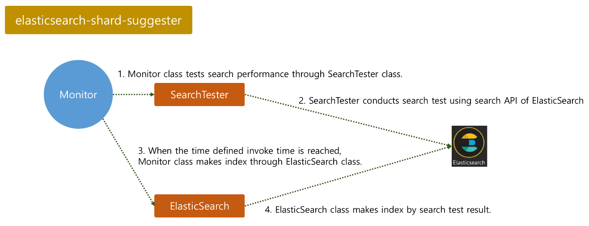

# elasticsearch-shard-suggester

_elasticsearch-shard-suggester_ 는 오늘자 인덱스의 검색 성능을 바탕으로 내일자 인덱스에 적합한 최적의 샤드 크기 및 갯수를 제안하는 스크립트 입니다.

## Version
```
0.02
```

## How to run

### 1. Virtual Environment Setting
```
$ git clone git@github.com:kakao/elasticsearch-shard-suggester.git
$ cd elasticsearch-shard-suggester
$ mkdir logs
$ virtualenv venv
$ . venv/bin/activate
(venv) $ pip install -r ./requirements.txt
```

### 2. Supervisord Setting
아래는 ini 파일 예제 입니다. 설치한 위치에 맞게 디렉터리 명은 변경해 주시면 됩니다.
```
[program:elasticsearch-shard-suggester]
command=/usr/local/elasticsearch-shard-suggester/venv/bin/python /usr/local/elasticsearch-shard-suggester/suggester.py
directory=/usr/local/elasticsearch-shard-suggester
killasgroup=true
stopasgroup=true
```

## Configuration
환경 설정 파일은 yaml 형태로 지원되며, 아래와 같이 구성할 수 있습니다.
처음 설치할 때는 ```conf/elasticsearch-shard-suggester.yml.template```을 ```conf/elasticsearch-shard-suggester.yml```로 복사하여 수정해서 사용할 수 있습니다.
```
application:
  invoke_hour: '16'
  query_interval: 60

# detail description of clusters option is below.
clusters:
  - url: elastic-1.cluster.com
    protocol: http
    port: 9200
    timestring: '%Y.%m.%d'
    threshold: 500
    replicas: 1
  - url: elastic-2.cluster.com
    protocol: https
    port: 9200
    timestring: '%Y-%m-%d'
    threshold: 300
    replicas: 1
    username: admin
    password: cGFzc3dvcmQ= #base64 encoded
    basis: yesterday
    shrink: True
    mode: dry_run

logging:
  loglevel: INFO
  logfile: logs/elasticsearch-shard-suggester.log
  format: '[%(levelname)s][%(asctime)s]%(message)s'
```

### cluster configuration details
|Option    |Required|Description|Value Type|
|----------|--------|-----------|-----|
|url       |true    |모니터링 하고자 하는 ElasticSearch 클러스터의 URL|String|
|protocol  |true    |ElasticSearch 클러스터의 URL에서 사용하는 프로토콜|http or https|
|timestring|true    |인덱스의 timestring 패턴|regexp ( ex. %Y.%m.%d)|
|threshold |true    |검색 성능의 임계치 (ms)|Integer|
|replicas  |true    |모니터링 하는 인덱스의 replicas 갯수|Integer|
|username  |false   |http basic authentication을 사용할 경우 username 기입|String|
|password  |false   |http basic authentication을 사용할 경우 password 기입, 이 값을 base64로 인코딩 되어야 함|String|
|basis     |false   |어제자 인덱스를 기준으로 오늘 인덱스를 생성할 때 사용, 기본값은 today|today or yesterday|
|shrink    |false   |기본값은 False, True로 하게 되면 인덱스 생성 시 계산된 최적의 샤드의 수가 데이터노드의 수보다 적을 경우에도 무시하고 계산된 샤드의 수를 적용|True or False|
|mode      |false   |기본값은 None, dry_run으로 설정할 경우 실제 인덱스 생성은 하지 않고 로그 상에 adjusted 라는 메세지만 생성|dry_run or blank|

### password encode
```
>>> import base64
>>> base64.b64encode("password")
'cGFzc3dvcmQ=' # use this value in configuration file.
```

## How it works
이 스크립트는 3개의 클래스로 구성되어 있습니다. Monitor 클래스는 부모 클래스, SearchTester 클래스는 ElasticSearch 클러스터에 검색 요청을 날리는 클래스, ElasticSearch 클래스는 ElasticSearch의 API를 래핑한 클래스 입니다.



1) Monitor 클래스가 SearchTester 클래스틑 통해서 검색 테스트를 진행 합니다.
2) SearchTester 클래스는 search API를 이용해서 검색 테스트를 진행 합니다. 이 쿼리는 원하는 쿼리로 수정할 수 있으며, 기본 쿼리는 하단에 나와 있습니다. 만약 이 쿼리를 변경하고자 할 때는 ```core/search_tester.py```파일을 수정하면 됩니다. 그리고 SearchTester 클래스는 ```preference=_shards:0```파라미터를 사용하기 때문에 검색 요청이 모든 샤드로 날아가지 않고 0번 샤드로만 날아 갑니다. 이를 통해서 단일 샤드의 검색 성능 테스트를 할 수 있습니다.
3) ```conf/elasticsearch-shard-suggester.yml``` 파일에 정의한 invoke_time이 되면 Monitor 클래스는 ElasticSearch 클래스를 통하여 내일자 인덱스를 생성합니다.
여기부터가 중요한 로직 입니다.
이 때, Monitor 클래스는 검색 성능을 바탕으로 최적의 샤드 크기와 샤드 갯수를 산정 합니다. 만약 오늘자 인덱스의 총 크기가 500GB이고, 10개의 샤드로 구성되어 있다고 가정하면 하나의 샤드는 50GB의 크기를 가지게 됩니다. 그리고 만약 환경 설정 파일 상에 정의된 threshold가 300ms이고, 실제 검색 성능이 150ms가 나온다면, 최적의 샤드 크기는 50GB의 두 배인 100GB로 결정 됩니다.
단일 샤드의 크기가 100GB로 결정되었기 때문에 최적의 샤드 갯수는 5개로 결정되고, 이에 따라 내일자 인덱스는 오늘과는 다르게 5개의 샤드로 생성 됩니다. 하지만 이렇게 계산된 샤드의 갯수가 데이터노드의 수보다 적을 경우에는 최소한의 성능 보장을 위해서 데이터노드 수만큼으로 다시 수정합니다. 위에 명시된 shrink 옵션이 True로 되어 있을 경우에는 데이터노드의 수를 고려하지 않고 계산된 샤드의 갯수를 적용 합니다.
4) ElasticSearch 클래스가 내일자 인덱스를 생성 합니다.

### Default Query
SearchTester 클래스가 사용하는 기본 쿼리는 아래와 같습니다.
```
{
    "query" : {
        "query_string": {
            "query": "*"
        }
    }
}
```

## License

This software is licensed under the [Apache 2 license](LICENSE.txt), quoted below.

Copyright 2018 Kakao Corp. <http://www.kakaocorp.com>

Licensed under the Apache License, Version 2.0 (the "License"); you may not
use this project except in compliance with the License. You may obtain a copy
of the License at http://www.apache.org/licenses/LICENSE-2.0.

Unless required by applicable law or agreed to in writing, software
distributed under the License is distributed on an "AS IS" BASIS, WITHOUT
WARRANTIES OR CONDITIONS OF ANY KIND, either express or implied. See the
License for the specific language governing permissions and limitations under
the License.